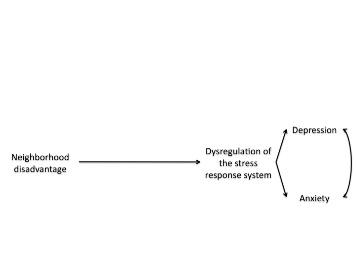
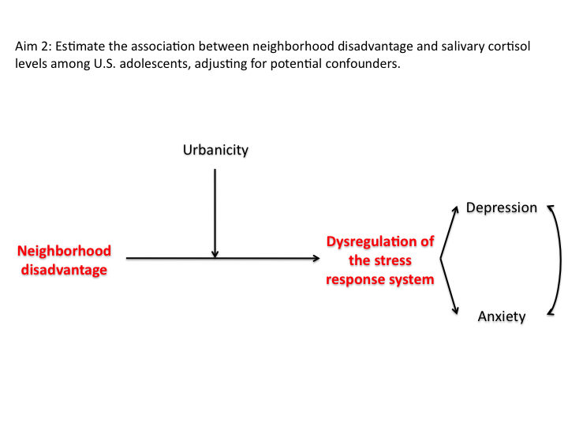
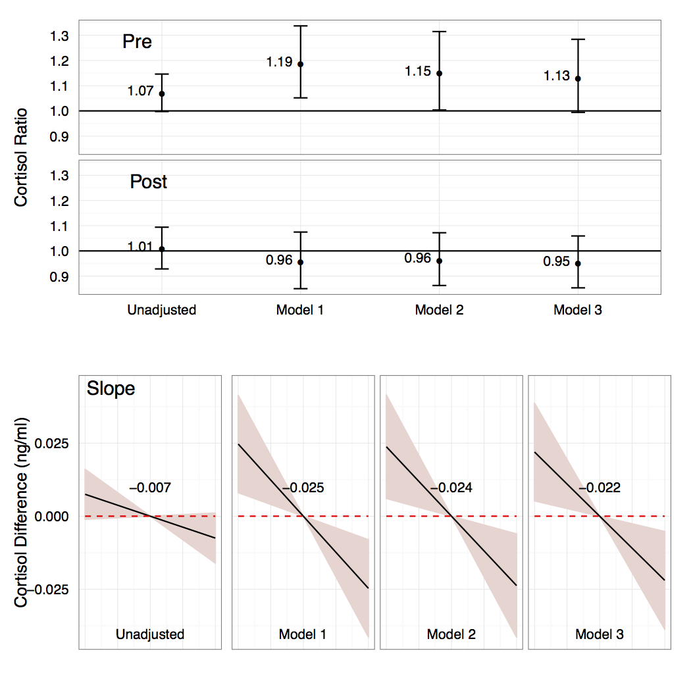

## Agenda

1. Motivation: adolescent anxiety and depression, influence of neighborhood, research gaps
2. Dissertation overview
3. Presentation of results
4. Discussion

--- 

## Motivation: Anxiety and Depression

<!---
My research so far has been motivated by the goal of working to improve the MH of teens in disadvantaged neighborhoods.
[maybe don't say this: MH is a significant public health problem, but I don't think it's received the attention comensurate with its magnitude.]  
For this talk, I'm going to be focusing on adolescent depression and anxiety
A US nationally representative survey found that nearly 12% of adolescents had ever had major depressive disorder and nearly 32% ever had an  anxiety disorder....

These disorders are not typically isolated, time-limited events, but can have consequence that extend over the lifecourse
Miss school and sociodevelopmental opportunities $\rightarrow$ negatively affect educational achievement (Breslau et al., 2008), future employment (Kessler et al., 2006), earnings (Kessler et al., 2008), family life (Kessler et al., 1998)

MHdisorders in childhood also [read]

in fact, depression and anxiety are the leading contributors to years lost to disability in the WHO disease burden rankings
-->

### Adolescent

(Merikangas et al., 2010)

---

## Motivation: Anxiety and Depression
### Adult 
* Depression: 500 million disability days/year, cost of 36B
* Anxiety: 700 million disability days/year
* WHO disease burden rankings

<!---
MHdisorders in childhood also Increase risk of disorders in adulthood $\rightarrow$ economic costs

in fact, depression and anxiety are the leading contributors to years lost to disability in the WHO disease burden rankings
-->

---

## Motivation: Importance of Place

<!---
So, it's clear that MH is imporatnat, but why neighborhood? 
well, intuitively, we understand that living in a neighborhood in east bmore may be a different experience than living in a neihgborhood in roland park. 
living in a disadvantaged neighborhood may entail exposure to more sources stress--e.g., violence, lack of opportunity, low-collective efficacy--that act to dysregulate the stress response system. 
For example, students who i taught creative writing to in DC had to deal wiht violence on a fairly regular basis. one of their classmates was even shot and killed. its hard to imagine that happening much in the surrounding wealthy suburbs. 
dysregulation of the stress response system has been linked to depression and anxiety disorders
-->

---

## Motivation: Research Gaps

<!---
There has been a lot of research into this relationship in the past 10 year,s, but results have been inocnsistent. 
I think some of these inconsistencies could be due to methodologic limitations that threaten inference
read bullets
sought to address several of  these possible contributing factors in my dissertation
-->

* Inconsistent results in the literature
  * Confounding (neighborhood assignment not random)
  * Positivity violations (economic and racial segregation of neighborhoods)
  * Non-transportability (neighborhood studies are typically conducted among a particular sub-population)

---

## Dissertation Overview

---

## Dissertation Overview

---

## Dissertation Overview

---

## NCS-A
<!---
read
read
CIDI = Composite international diagnostic interview, corresponds to DSM-IV and ICD-9 diagnoses
-->
* Nationally representative sample of U.S. adolescents 13-17 years old (N=10,123)
* Sources of information relevant to this dissertation:
  * Face-to-face, computer-assisted interviews with the adolescent. 
    * CIDI modified for adolescents.
  * Saliva collected before and after each interview.
  * Self-administered questionnaire to parents or parent surrogate of the adolescent.
  * Geocoded residence.

---

## Aim 1

---

## Aim 1: Background

### Gaps
* Inconsistent results 
* Hypothesis: effect modification by urbanicity may contribute to inconsistent results.

<!---
Inconsistent results in neighborhood disadvantage-adolescent mental health relationship.
* Studies reporting an association between neighborhood disadvantage and depression/anxiety tended to sample from urban populations; studies reporting no association tended to sample from non-urban populations or a mix.
This may be because living in a disadvantaged neighborhood in an urban area entails exposure to a diffrent set of stressors than living in a disadvantaged neighborhood in a rural area.
for example, Lack of green space, noise, residential instability and exposure to violence may all be potential stressors that are more prevalent in disadvanatged neighborhoods.
there is some evidence that these stressors are linked to emotional disorders 
* Hypothesis: effect modification by urbanicity may contribute to inconsistent results. The association between neighborhood disadvantage and adolescent depression/anxiety may be greater in urban versus non-urban neighborhoods.
-->

---

## Aim 1: Background
### Study  
* NCS-A well-suited to evaluate this question. 
  * Nationally representative survey of U.S. adolescent mental health (DSM-IV)
  * Geocoded residences, samples include mix of urban, suburban, and rural.   

--- &twocol w1:30% w2:70%

## Aim 1: Analysis

<!---
* Multiple imputation by chained equations for missing data.
* Propensity score subclassification, excluding those without similar counterparts (4.7%). 
 * Addresses confounding and structural positivity stemming from non-random assignment of neighborhood residence.
* Survey design-based, weighted analysis to maintain the national representativeness of the sample.  
-->

*** left
* Multiple imputation by chained equations
* Propensity score subclassification, excluding those without similar counterparts (4.7%)
* Survey design-based, weighted analysis

*** right

--- &twocol w1:30% w2:70%

## Aim 1: Analysis

*** left
* Multiple imputation by chained equations
* Propensity score subclassification, excluding those without similar counterparts (4.7%)
* Survey design-based, weighted analysis

*** right

--- 

## Aim 1: Results

<!---
dose response
adolescents in disadvantaged neighborhoods have 59% (1.25, 2.03) greater odds of having a prevalent emotional disorder than those in disadvantaged neighborhoods if that niehgborhood is in an urban center
the interaction between urban center and neighborhood dis is also significant. 
Specifically, the association between neighborhood disadvantage and emotional disorder is more than twice as large (ratio of odds ratios: 2.08, 95% CI: 1.23, 3.55) for adolescents living in urban centers versus non-urban areas
-->

---

## Aim 2

---

## Aim 2: Background

### Gaps
* Few studies
* Small sample size
* Racial/ethnic homogeneity
* Geographic homogeneity

<!---
* Limited previous research in adolescents (Brenner et al., 2013; Chen and Paterson, 2006; Hackman et al., 2012). Found associated with higher resting cortisol, greater reactivity.
* Limited by small sample size and racial/ethnic and geographic homogeneity.
these three studies were only in single urban areas (flint, St Louis, Philadelphia)
2/3 studiies were only of african americans
small! (163, 100, 79)
-->

---

## Aim 2: Background

<!---
* NCS-A also well-suited to address gaps in previous research. 
-->

### Study

* Largest sample to date (2,490 have cortisol measurements).
* Racially and ethnically diverse. 
* Participants drawn from different regions of the U.S., urbanicities. 

--- &twocol 

## Aim 2: Background

*** left
<!---
Before I get into the specifics of our analysis, I want to convey what we were up against. Examining the relationship between neighborhood sources of stress and cortisol involves a lot of complexity. 
First, this relationship depends on the dimension of the HPA axis being measured. Stress researcher Bruce McEwen says that there are two main dimensions. (1) resting, unprovoked levels and (2) and reactivity to an acute stressor
* History of exposure to stress. 
  * Those who have been exposed to the most stress---children who are abused---have cortisol levels that look more similar to unstressed children.
  * Reactivity tends to increase with some stress, but becomes blunted with a lot of stress, like abuse
This hasalso been called weathering because the idea is that after repeated or prolonged activations, this response wears out. 
-fourth bullet.
Cortisol has an initial spike when we first wake up. called the cortisol awakening response. see graph. after this initiatl spike, declines for the rest of the day. 
and the relationship between enighborhood sources of stress may differ depending on time of day. 
graph compares cortisol levels on the y axis over time on the axis between tertiles of neighborhood violence
see that in high-violence neighborhoods cortisol levels are lower during CAR but higher during the post-CAR decline
-->
Relationship between neighborhood sources of stress and cortisol levels is complex
* HPA axis dimension 
* Weathering
* Time of day

*** right 

  (Do et al., 2011.)

--- 

## Aim 2: Analysis

<!---
given this complexity, cortisol is ideally measured under very strict laboratory protocols, but this wasn't the case in this study.
we were left with the challenge: Challenge: How to construct a controlled analysis? 
I'm going to go through some of these challenges and then how we addressed them.

Challenge: * Some kids not at-risk for a cortisol response; cortisol levels may be artificially influenced. 
Approach: * Restrictive exclusion criteria: pregnant or taking oral contraceptives, diabetic, possibly using steroid inhaler, psychiatric medication, current smokers or drug users. 

Challenge: * Some kids may experience blunting.
Approach: * Sensitivity analysis excluding those with severe adversity

challenge: * Relationship may differ depending on CAR versus post-CAR
Approach:* Cortisol measured after CAR

challenge: * Cortisol exhibits a strong diurnal rhythm, but measures taken at all times of day
Approach: * Propensity score matching with replacement   * Caliper matching on sample time (0.2 SD)

challenge: * Without regard to weekend/weekday, season
Approach: * Propensity score matching with replacement   * Exact matching on weekend/weekday
  * Exact matching on race/ethnicity
(Just in case: severe adversity defined as adolescents who reported phsyical abuse by their parent (being beaten up, choked, kicked, punched, burned, bitten threatened with a gun or reported 3 or more of the following: parent suicide attempt or completion, parent alcohol abuse, parent drug abuse, parent arrest or imprisonment)
-->

Challenge | Approach
--------- | --------
Not at-risk for a cortisol response | Restrictive exclusion criteria
Blunting | Sensitivity analysis
Heterogeneity by CAR/ post-CAR | Restricted to post-CAR
Diurnal rhythm | PS with caliper matching 
Other strong predictors | PS with exact matching

--- &twocol w1:40% w2:60%

## Aim 2: Analysis

*** left

*** right

* Multiple imputation by chained equations
* Regression outcome analyses on matched, imputed datasets
  * Gamma regression for point-in-time measures
  * Linear regression for cortisol rate

---

## Aim 2: Results
<!---
Top portion, showing conditional expected ratios of cortisol levels comparing adolescents in disadvantaged neighborhoods to those in non-disadvatnaged neighborhoods. Point estimates and 95% CI
Panel A is for the pre-interview cortisol levels and Panel B is for the post-interview cortisol levels.
Panel C shows the conditional expected diffrences in cortisol slope during the late decline period comparing adolescents living in disadvantaged versus non-disadvantaged neighborhoods.
Again, we show the estimate and 95% CI
In each of the three panels, we show the results for the unadjusted and 3 adjusted models. 
All adjusted models used adjusted for possible confounders listed in the previous figure in both propesntiy score matching and regression. These possible confounders preceded the exposure.
Adjusted model 2 added variables for which there could be debate about whether they precede the exposure of follow it. So, they could be confounders and mediators. These were family income and employment history and current status.
Adjusted model 3 added hypothesized mediators: small for gestational age, BMI, and sleep variables like typical bedtime on weekdays, bedtime on weekends, typical hours slept on weeknights and typical hours slept on weekends. 
So in all the models, we see that adolescents in disadvantaged neighborhoods have slightly higher cortisol levels prior to the interview than those in disadvantaged neighborhoods. 
We see that there's no real difference in post-interview levels. 
Adolescents in disadvantaged neighbrohoods have slighly steeper cortisol rates of decline over the course of the interview than those in non-disadvantaged nieghborhodos. 
We interpreted these results as possibly reflecting heightened reactivity to and recovery from the novel stimulus of the interview. 
It's imporant to reiterate that we were not measuring HPA axis dimensions, so we can't make conclusions baout these.
Instead, the pre-interview levels likely reflect any activity the adolescent was engaged in prior to the interview as well as anticipation of the new situation of being interviewred in her home by a researcher for ta survey on mental health. Something out of the ordinary!
The interview was specifically designed not to be stressful, so adoelscents probably became pretty bored over the course of the interview. The post-interview levels may relfect that as well as the fact that now the adolescent has been sitting down for 2 and a half hours. 
Our findings and interpretation agree with previous human and animal aresearch. 
For examples, rats stressed when young have heighted less controlled responses to novel situations. 
young children under some stress have hghier cortisol levels there 1st day of kindergargen
congruent with one of the snmall studies on ND and coritosl in adolsecents that found that those in ND have greater reactivity to a stress test than those in non-dis neighbohroods
-->

---

## Aim 3: Background
Problem raised in Aim 2: 
* Want to generalize association estimated in sub-sample to U.S. adolescents 
* May not generalize if:
  1. effect heterogeneity and 
  2. sub-sample selection probabilities depend on effect modifiers

<!---
Problem raised in Aim 2: 
* Want to estimate the association between living in a disadvantaged neighborhood and cortisol slope in a nationally representative sample, but only have cortisol data on a sub-sample. 
* Estimated associations may be different from those estimated in the complete sample if there is:
  1. effect heterogeneity and 
  2. sub-sample selection probabilities depend on effect modifiers

Broadly, problem of generalizing results from a non-randomized study sample to a specified target population.

not the same type of missing data problem typically considered in this literature, because we are dealing with survey data and we do not observe any data for individuals not in the survey
-->

---

## Aim 3: Background
Need to control for: 
* Non-random assignment of families into neighborhoods 
* Non-random selection into survey
* Non-random selection into the cortisol sample

<!---
Problem raised in Aim 2: 
* Want to estimate the association between living in a disadvantaged neighborhood and cortisol slope in a nationally representative sample, but only have cortisol data on a sub-sample. 
* Estimated associations may be different from those estimated in the complete sample if there is:
  1. effect heterogeneity and 
  2. sub-sample selection probabilities depend on effect modifiers

Broadly, problem of generalizing results from a non-randomized study sample to a specified target population.

not the same type of missing data problem typically considered in this literature, because we are dealing with survey data and we do not observe any data for individuals not in the survey
-->

---

## Aim 3 

---

## Aim 3: Analysis
<!---
Use simulation to evaluate 3 methods to estimate PATE, $E(Y_1 - Y_0)$, from survey sub-sample  under various data distributions and model misspecifications
  * Compare IPW, DRWLS, TMLE (both DRWLS and TMLE are both DR estimators)
-->

### Simulation study
* Estimand: PATE 
* Estimators
  * IPW
  * DRWLS
  * TMLE

--- 

## Aim 3: Analysis
### Simulation study

---

## Aim 3: Analysis
### Simulation study
### Apply estimators to motivating example

<!---
Use simulation to evaluate 3 methods to estimate PATE, $E(Y_1 - Y_0)$, from survey sub-sample  under various data distributions and model misspecifications
  * Compare IPW, DRWLS, TMLE (both DRWLS and TMLE are both DR estimators)
* Apply estimators to motivating example., providing a tutorial, including code 
-->

---

## Aim 3: Results
<!---
In this simulation, we considered two different scenarios. one with linear EH and one with non-linear EH. 
Here are the results when we correctly specified the parametric model for each scenario. 
Scenario 1 is on the left and Scenario 2 is on eth eright. 
The x axis shows the estimated PATE and there is a red line at the true value, which is 3 in both scenarios
The estimators are on the y axis. Show the importance of adjusting for all 3 sources of non-randomness: 
selection into survey, selection into subsample, non-random treatment assignment.
Top estimators adjust for 0, 1, or 2 of the soures. Bottom 3 estimators adjust for all 3.
Naive method, we do't adjust for anything .we just subtract the average outcome value for those without the treatment from the average outcome value for those with the treatment.
below that, IPSW shows how the estimate improves when we adjust for selection into the survey sample
below that, IPTW adjusts for non-random treatment assignment
IPTSvy W adjusts for nonrandom treatment assignment and selection into the survey, but does not account for nonrandom selection into the sub-sample. 
IPW, DRWLS and TMLE all  acoun for nonrandom treatment and both selection mechanisms
We see that each of these methods is unbiased and it turns out that both DRWLS and TMLE perform better than IPW in terms of % bias, Var, 95% CI Coverage and MSE.
-->
 

---

## Aim 3: Results
<!---
This table summaries the meat of our results. as i showed before, we evaluated each estimator under the two different scenarios. 
we did this when when correctly specified the parametric model, but also under various misspecifications. 
"Mod" stands for moderate misspecification where we have all teh correct variables, but the incorect for
"Maj" stands fo major misspeicifiacation where we are missing a variable. 
We misspecify each of the treatment, selection, and outcome models. 
We see that in general both DRWLS and TMLE perform well when any one of the models is misspecified.
-->

---

## Dissertation Conclusions

<!---
I'd like to wrap up with some overall conclusions from this work
In this dissertation, we find further support...[read]
* Further support for the link between neighborhood and mental health. 
  * Living in a disadvantaged neighborhood associated with $\uparrow$ odds of depression/anxiety for teens if that neighborhood is in an urban center but not otherwise.
  * Living in a disadvantaged neighborhood associated with cortisol levels for teens. In sub-sample and for U.S. adolescents.
  
We also evaluate methods to estimate effects/ associations [read]
specifically, we recommend two DR methods as opposed to IPW. These methods are similar to IPW in terms of their straightforward implementation, but because they are double robust, they perform much better than IPW under incorrect specification of one of the treatment or selection models.

Broad applications stemming from these conlcusions include:
[read]
-->

* Link between neighborhood and mental health.
  * Disadvantaged neighborhood associated with $\uparrow$ odds of depression/anxiety if urban center 
  * Disadvantaged neighborhood associated with cortisol levels
* Estimating effects/associations from a survey sub-sample
  * DRWLS and TMLE vs. IPW

---

## Dissertation Conclusions
### Broad applications:
  * Targeting interventions to those subpopulations who may benefit most
  * Facilitate generalizability/transportability of findings 

<!---
Broad applications stemming from these conlcusions include:
[read]
-->

---

## Limitations

* Neighborhood disadvantage as exposure
  * Measurement limitations
  * Theoretical limitations

<!---
Before ending, I'd like to review a few of the dissertation's limiations and strengths.
For example, there are a number of limitations that stem from using neighborhood disadvantage as the exposure of interest
first, ND is measured with error 
this is because
1. this is a latent variable and we are using a summary measure as a proxy
2. CTs are not neighborhoods
[(maybe don't say this)
3. cut-point of disadvantage v not (Addressed in sensitivity analyses)
4. measurement may be differential by urbanicity (addressed in sensitivity analyses)]

second, there's the theoretical limiation that
1. neighborhood disadvantage does not mean the same thing for everyone. 
for one adolescent, living in a disadvantaged neighborhood may mean being exposed to multiple sources of neighborhood violence witnessing and victimization, loud noise from traffc, and interacting with neighbors and schoolmates who are relatively homogenous in their socioeconomic makeup. For another adolescent, living in a disadvantaged neighborhood may mean being exposed to violence witness- ing, but not victimization, minimal noise, and interacting with schoolmates who have a relatively diverse socioeconomic makeup. In our analyses, both of these adolescents would be classified as living in disadvantaged neighborhoods. [maybe don't say this: This is a violation of the causal inference assumption, SUTVA, which assumes only one version of each treat- ment/exposure.]
I think this is fairly significant limitation, and In future work, I would like to focus on studies with well-defined and potentially modifiable treatments/exposures. 
would aid inference as well as the study’s practical utility informing policies and programs. 
[may be don't say this either: 2. ND PS model assumes that variables in teh model are measured without error. 
examining this assumption--the effects of estimating PS when vars measured with error and strategies to relax this assumption will be area of postdoctoral work]
-->

---

## Limitations

* Cortisol as outcome
  * Measurement limitations
  * Theoretical limitations

<!---
Cortisol as outcome
Measurement limitations
cortisol is sensitivite to a wide range of factors (e.g., light, temperature, noise, level of physical activity, smoking, drinking) that are typically held constant in when cortisol is measured under laboratory conditions, but were not able to be held constant in its collection in this case. 
the study did not use protocols that correspond to one of the HPA axis domains. administer either a standardized acute stressor (e.g., a Trier stress test) or rest period are required. we cannot infer that the cortisol outcomes in Aim 2 map onto specific HPA axis dimensions.

cortisol is only one of mahy stress biomarkers
  1. primary mediators, primary effects, secondary effects
  2. multiple systems: HPA axis, sympathetic nervous system
  and 3. multiple systems affected: metabolic, immunologic, cardiovascular

this is all to say that this is complex and cortisol is just showing us one piece
-->

---

## Strengths

<!---
* Sample: large, racial/ethnically and geographically diverse, nationally representative of U.S. adolescents
  * Ability to answer questions about effect modification that previously could not be answered
  * Address generalizability
* Address issues that pose particular challenges in neighborhood studies: 
  * Confounding due to non-random neighborhood assignment: PS methods, sensitivity analyses for an unobserved confounder
  * Structural positivity violations due to economic and racial segregation: PS methods, limiting to comparable sub-sample
* Facilitate use of DR methods over IPW for simultaneously addressing non-random treatment assignment and non-random sample selection. Demonstrate TMLE implementation in the case of survey weights. 
-->

* Sample
* Address issues that pose particular challenges in neighborhood studies 
* Facilitate use of DR methods over IPW

---

## Acknowledgements

<!---
I am deeply appreciative of the support, encouragement, and guidance of others in completing this dissertation. In particular, I would like to thank my advisors, Drs. Tom Glass and Liz Stuart. Tom provided me with encouragement to tackle the issues that inspired me from the beginning of the Ph.D. program. His careful think- ing and embracing of complexity modeled patience and thoroughness in approaching research questions. Liz provided me with innumerable hours of advice in applying causal inference methods. She pushed me further than I would have pushed myself in applying more advanced methods and becoming a better programmer (and frequent cluster user). In the process, I discovered that this meld of causal inference and social epidemiology was the research area that most excited me.
I would also like to thank my committee members, Drs. Rosa Crum and Gary Wand, as well as Drs. Kathleen Merikangas, Bill Eaton, Michael Rosenblum, and Iva ́n D ́ıaz for their many conversations and guidance over the years and iterations of this dissertation. They have deepened my understanding of both substantive and methodological issues within this dissertation and helped place these issues within the broader literature. This dissertation is truly a collaborative e↵ort with all of them.
I’ve been fortunate during my time in the Ph.D. program to be the recipient of several generous funding mechanisms, including an NIMH pre-doctoral training fellowship and Sommer scholarship. These have allowed me to dedicate more attention and time to research and less to worrying about paying the bills. Finally, I would like to thank my husband, William, for his support, grocery shopping, and whistling; my parents, Lisa and Kurt Rudolph, and brother Scott Rudolph, for their encouragement; and many friends for their enthusiasm.
-->

* Ph.D. Advisor: Tom Glass 
* M.H.S. Advisor: Liz Stuart
* Dissertation committee: Rosa Crum, Gary Wand
* Dissertation collaborators: Kathleen Merikangas, Bill Eaton, Michael Rosenblum, Ivan Diaz
* Funding: Department of Epidemiology, NIMH intramural training fellowship, Sommer Scholarship
* William
* Family: Scott, Lisa and Kurt
* Friends
