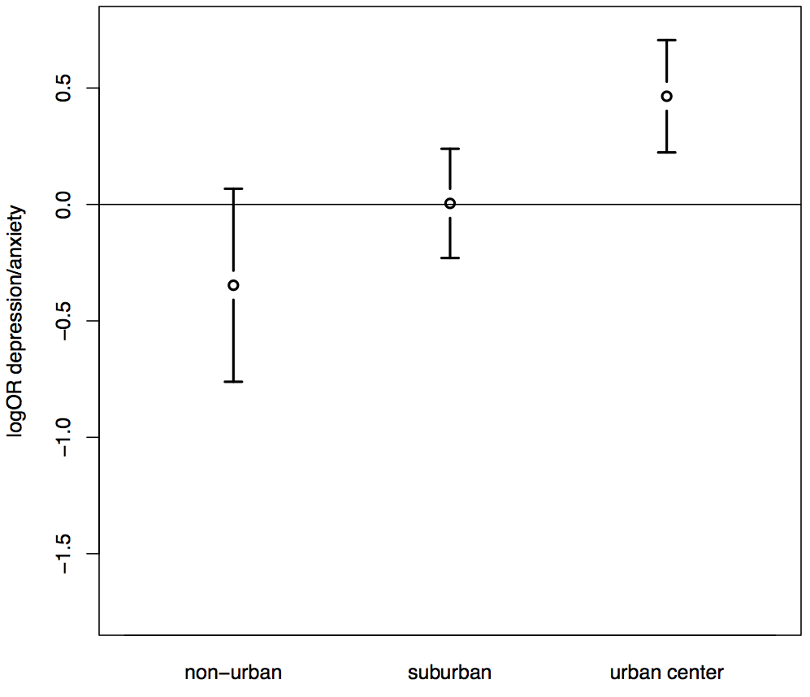

## Agenda

1. Progress update
2. Timeline going forward
3. Presentation of results, challenges
4. Schedule next meeting

---

## Progress Update
1. Aim 1
  * June 2012: poster presentation at SER conference
  * March 2013: published: KE Rudolph, EA Stuart, TA Glass, KR Merikangas. Neighborhood disadvantage in context: the influence of urbanicity on the association between neighborhood disadvantage and adolescent emotional disorders. _Soc Psychiatry Psychiatr Epidemiol_.
2. Aim 2
  * June 2013: poster presentation at SER conference
  * November 2013: in press: KE Rudolph, GS Wand, EA Stuart, TA Glass, AH Marques, R Duncko, KR Merikangas. The association between cortisol and neighborhood disadvantage in a U.S. population-based sample of adolescents. _Health Place_.
3. Aim 3
  * August 2013: paper drafted
  * December 2013: plan to submit to _American Journal of Epidemiology_
  * August 2014: oral presentation at JSM 

---

## Timeline

* Early December: Distribute reader copies of dissertation

* January: Defense

* January: Start post-doc with Liz Stuart

---

## Dissertation Overview
_Mental Health in Context: Effect Heterogeneity and Mechanism in the Relationship between Neighborhood Disadvantage and Adolescent Depression and Anxiety_

---

## Dissertation Overview
Aim 1: Estimate (A) the association between neighborhood disadvantage and odds of prevalent emotional disorders and (B) the extent to which this relationship differs by urbanicity among U.S. adolescents, adjusting for potential confounders.  

---

## Dissertation Overview
Aim 2: Estimate the association between neighborhood disadvantage and salivary cortisol levels among U.S. adolescents, adjusting for potential confounders.
 
 

---

## Dissertation Overview
Aim 3: Evaluate methods to estimate a marginal mean effect in the presence of effect heterogeneity, a double selection mechanism, and treatment bias.  
 

---

## Aim 1

### Background
* Inconsistent results in neighborhood SES-adolescent mental health relationship.
* Studies reporting an association between neighborhood disadvantage and depression/anxiety tended to sample from urban populations; studies reporting no association tended to sample from non-urban populations or a mix.
* Hypothesis: effect modification by urbanicity may contribute to inconsistent results. The association between neighborhood SES and adolescent depression/anxiety may be greater in urban versus non-urban neighborhoods.    

### Study  
* NCS-A well-suited to evaluate this question. 
  * Cross-sectional, nationally representative survey of U.S. adolescent mental health (DSM-IV)
  * Geocoded residences, samples include mix of urban, suburban, and rural.   

--- &twocol w1:30% w2:70%

## Aim 1

*** left

### Analysis 
* Propensity score subclassification with a survey design-based, weighted analysis to address confounding and structural positivity stemming from non-random assignment of neighborhood residence while maintaining the national representativeness of the sample.  

*** right

---

## Aim 1 Results

---

## Aim 1 Challenges

* Combine multiple imputation with propensity score methods with survey design-based analysis
  * Liz pointed me to a paper that combined propensity score subclassification with survey design-based analysis
  * Hand coding
* Present (past 12-month) versus lifetime emotional disorder, which sub-disorders to include
  * Rosa and Kathleen provided conversation and guidance
* The association could be an artifact of measurement variance if the measurement of neighborhood disadvantage differs by urbanicity.
  * Tom raised concern $\to$ sensitivity analysis using factor scores obtained by multiple-group confirmatory factor analysis.   

--- &twocol 

## Aim 1 Challenges

*** left

Because exposure is not randomized, the association could be an artifact of unobserved confounding.
* Liz suggested sensitivity analysis for unobserved confounder.
* Adapted bias equations in  TJ Vanderweele, OA Arah. _Epidemiology_ 2011;22(1):42-52.
* Setting the conditional probability of a given unobserved confounder to 80% in disadvantaged neighborhoods, the unobserved confounder would need to be twice as prevalent in disadvantaged v. nondisadvantaged neighborhoods and be associated with 1.4 times greater odds of prevalent depression/anxiety to change our inference.  

*** right

---

## Aim 2

### Background
* If there is a neighborhood SES-adolescent mental health association, it may operate through dysregulation of the stress response system. 
* Limited previous research in adolescents.
* Limited by small sample size and racial/ethnic and geographic homogeneity.
 
### Study
* NCS-A also well-suited to address gaps in previous research. 
  * Participants drawn from different regions of the U.S., urbanicities. Racially and ethnically diverse. Largest sample to date.  
 

--- &twocol w1:40% w2:60%

## Aim 2 

*** left

### Analysis
* Propensity score matching methods combined with regression adjustment to address non-random selection of families into neighborhoods. 
* Traditional propensity score matching supplemented with exact and caliper matching to strengthen bias reduction for variables shown to be influential drivers of cortisol variability.

*** right

---

## Aim 2 Results

---

## Aim 2 Challenges

* Exclude participants whose cortisol levels may not be able to be affected by neighborhood sources of stress
  * Gary and Rosa (actually in last thesis committee meeting) helped think through which individuals' cortisol levels may be artificially influenced $/to$ primary analysis excluded current smokers and drug users, sensitivity analyses relaxed these exclusions to exclude (1) current smokers only and (2) neither
  * Gary raised concern about having mixture of adolescents who have hypersensitive cortisol reactivity and blunted cortisol reactivity $/to$ sensitivity analysis excluding those who experienced a lot of trauma
* Interpretation of results---HPA axis dimensions not measured
  * Gary and Tom helped with wording to ensure communiticating importance without overstating our case

--- &twocol 

## Aim 2 Challenges

*** left

* Because exposure is not randomized, the association could be an artifact of unobserved confounding.
  * Moderately sensitive. Setting the conditional probability of a given unobserved confounder to be 20% greater in a disadvantaged versus nondisadvantaged neighborhoods, the unobserved confounder would have to bias the conditional mean cortisol slope by 98% to change our inference.

*** right

---

## Aim 3 
### Background
* Problem raised in Aim 2: 
  * Want to estimate the association between living in a poor neighborhood and cortisol slope in a nationally representative sample, but only have cortisol data on a sub-sample. 
  * Estimated associations may be different from those estimated in the complete sample because of effect heterogeneity. 
* Need to control for non-random assignment of families into neighborhoods as well as non-random selection into the cortisol sample. Broadly, problem of generalizing results from a non-randomized study sample to a specified target population.
* Very little statistical work on how to address both sources of non-randomness together.
* Even less statistical work on doing this in the presence of a double selection mechanism

---

## Aim 3
### Study
* Use simulation to evaluate methods to address both sources of non-randomness together in the presence of effect heterogeneity and a double selection mechanism. 
* Apply estimators to motivating example. 

---

## Aim 3 Results

--- &twocol

## Application to example data

*** left

*** right

---

## Aim 3 Challenges

* Puzzle of why TMLE is not robust in the presence of misspecification of outcome model. 
  * Liz and Ivan Diaz have helped think through and eliminate possibilities.
* Broaden audience interest and applicability.
  * Liz helped with reframing from double selection only to a missing data problem that could apply to selection, censoring, non-response, etc.
* Estimators to include and putting them in context.
  * Michael Rosenblum provided key references and information on context.

---

## Collaborations outside of thesis

* Rudolph KE, Glass TA, Crum RM, Schwartz BS. Neighborhood psychosocial hazards and binge drinking among late middle-aged adults. _J Urban Health._ 2013; 90(5): 970-82.
* Work with Derek Cummings' and Justin Lessler's group estimating incubation periods of various infectious diseases from systematic reviews of the literature.
  * Rudolph KE, Lessler J, Moloney R, Kmush B, Cummings DAT. Incubation periods of mosquito-borne infections: a systematic review. _Am J Trop Med Hyg_. 2013: In press.
  * Lee RM, Lessler J, Lee RA, Rudolph KE, Reich NG, Perl TM, Cummings DA. Incubation periods of viral gastroenteritis: a systematic review. _BMC Infect Dis_. 2013 Sep 25;13(1):446.
  * Azman AS, Rudolph KE, Cummings DA, Lessler J. The incubation period of cholera: a systematic review. _J Infect_. 2013 May;66(5):432-8
* Current collaboration with Deb Perry, associate professor at Georgetown, evaluating a home visiting program for low-income pregnant women in Philadelphia
* Current collaboration with MESA Stress group 
* Marriage!

---

## General feedback
* Feedback from you
  * Title: Mental Health in Context: Effect Heterogeneity and Mechanism in the Relationship between Neighborhood Disadvantage and Adolescent Depression and Anxiety
  * Aim 3: framing 
  * Aim 3: other sensitivity analyses
* Scheduling

---

## Thanks!
